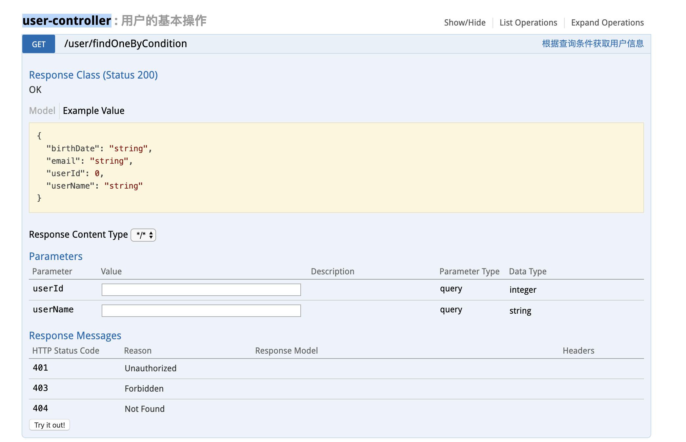
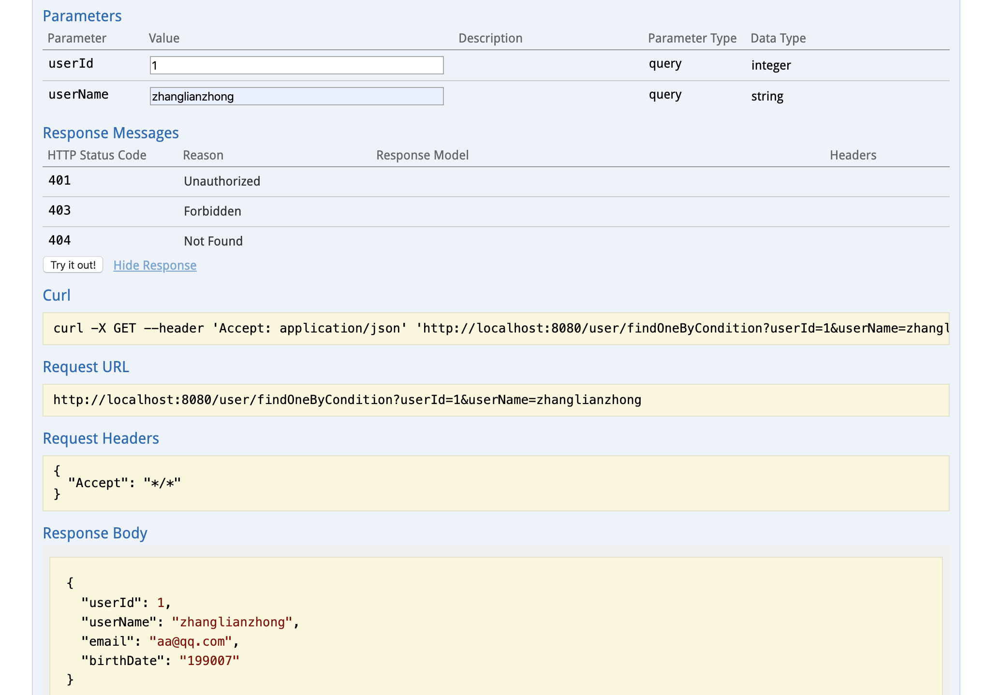

## Springboot 项目集成Swagger报告
Author:Zhang Lianzhong

相信无论是前端还是后端开发，都或多或少地被接口文档折磨过。前端经常抱怨后端给的
接口文档与实际情况不一致。后端又觉得编写及维护接口文档会耗费不少精力，经常来不及
更新。其实无论是前端调用后端，还是后端调用后端，都期望有一个好的接口文档。但是这
个接口文档对于程序员来说，就跟注释一样，经常会抱怨别人写的代码没有写注释，然而自
己写起代码起来，最讨厌的，也是写注释。所以仅仅只通过强制来规范大家是不够的，随着
时间推移，版本迭代，接口文档往往很容易就跟不上代码了。

Swagger2 的出现就是为了从根本上解决上述问题。它作为一个规范和完整的框架，可以用
于生成、描述、调用和可视化 RESTful风格的Web服务：
```
1. 接口文档在线自动生成，文档随接口变动实时更新，节省维护成本

2. 支持在线接口测试，不依赖第三方工具
```
### 集成Swagger步骤
1 项目pom文件引入以下包：

io.springfox:springfox-swagger2:2.6.1

io.springfox:springfox-swagger-ui:2.6.1
```xml
		<dependency>
			<groupId>io.springfox</groupId>
			<artifactId>springfox-swagger2</artifactId>
			<version>2.6.1</version>
		</dependency>
		<dependency>
			<groupId>io.springfox</groupId>
			<artifactId>springfox-swagger-ui</artifactId>
			<version>2.6.1</version>
		</dependency>

```

2 创建swagger配置类
```java
@Configuration
@EnableSwagger2
@ConditionalOnProperty(prefix = "swagger2",value = {"enable"},havingValue = "true")
public class Swagger2Config {

    @Bean
    public Docket createRestApi() {
        return new Docket(DocumentationType.SWAGGER_2)
                .apiInfo(apiInfo())
                .select()
                .apis(RequestHandlerSelectors.basePackage("com.acceptance.springbootswagger.controller"))
                .paths(PathSelectors.any())
                .build();
    }

    private ApiInfo apiInfo() {
        return new ApiInfoBuilder()
                .title("Springboot利用Swagger构建api文档")
                .description("Swagger2整合测试用例")
                .termsOfServiceUrl("http://www.cmac.com")
                .version("1.0")
                .build();
    }
}
```
注解@Configuration表明这是一个配置类，@EnableSwagger2 开启Swagger功能，
@ConditionalOnProperty注解表明这是个条件配置类，只有当application.yml文件中
配置了swagger.enable该参数，并且值为true，该配置类才会生效。通过该条件注解，可以
轻松实现测试环境开启，生产环境关闭wagger效果。

成员方法 createRestApi 函数创建 Docket的Bean之后，apiInfo()用来创建该Api 
的基本信息（这些基本信息会展现在文档页面中）。select()函数返回一个ApiSelectorBuilder
实例用来控制哪些接口暴露给Swagger来展现，本例采用指定扫描的包路径来定义，Swagger 会扫描
该包下所有 Controller 定义的API，并产生文档内容（除了那些被 @ApiIgnore 指定的请求。

3 API 接口编写
在完成了上述配置后，其实已经可以产生文档内容，但是这样的文档主要针对请求本身，而描述
主要来源于函数等命名产生，对用户并不友好，我们通常需要自己增加一些说明来丰富文档内容。
```java
@RestController
@RequestMapping("/user")
@Api(value = "用户服务",description = "用户的基本操作")
public class UserController {

    @ApiOperation(value = "用户列表服务",notes = "查詢所有用戶的列表信息")
    @RequestMapping(value = "/list",method = RequestMethod.GET)
    public List<User> list() {
        List<User> userList = new ArrayList<>();
        for(String key: DataNode.users.keySet()) {
            userList.add(DataNode.users.get(key));
        }
        return userList;
    }

    @ApiOperation(value ="根据用户ID查询用户信息",notes="根据url的id来获取用户详细信息")
    @ApiImplicitParam(name="userId",value = "用户ID",required = true,dataType ="Integer",paramType = "path")
    @RequestMapping(value = "/findOneById/{userId}",method = RequestMethod.GET)
    public User findOneById(@PathVariable("userId") Integer userId) {
        for(String key: DataNode.users.keySet()) {
            User user = DataNode.users.get(key);
            if(user.getUserId() == userId) {
                return user;
            }
        }

        return null;
    }

    @ApiOperation(value = "根据用户名获取用户信息")
    @RequestMapping(value = "/findOneUserName/{userName}",method = RequestMethod.GET)
    @ApiImplicitParam(name = "userName",value = "用户名",required = true,dataType = "String",paramType = "path")
    public User findOneByName( @PathVariable("userName") String userName) {
        for(String key: DataNode.users.keySet()) {
            User user = DataNode.users.get(key);
            if(user.getUserName().equals(userName)) {
                return user;
            }
        }

        return null;
    }

    @ApiOperation(value = "根据用户名获取用户信息")
    @ApiImplicitParams({
            @ApiImplicitParam(name = "id", value = "用户ID", required = true, dataType = "int", paramType = "query"),
            @ApiImplicitParam(name = "userName", value = "用户名称", required = true, dataType = "String", paramType = "query")
    }
    )
    @RequestMapping(value = "/findOneByIdAndName",method = RequestMethod.GET)
    public User findOneByIdAndName(@RequestParam String userName, @RequestParam Integer id) {
        for(String key: DataNode.users.keySet()) {
            User user = DataNode.users.get(key);
            if(user.getUserName().equals(userName) && id==user.getUserId()) {
                return user;
            }
        }

        return null;
    }

    @ApiOperation(value = "根据查询条件获取用户信息")
    @RequestMapping(value = "/findOneByCondition",method = RequestMethod.GET)
    public User findOneByCondition(UserCondition userCondition) {
        for(String key: DataNode.users.keySet()) {
            User user = DataNode.users.get(key);
            if(user.getUserName().equals(userCondition.getUserName()) &&
                    user.getUserId()==userCondition.getUserId()) {
                Car car = new Car();
                car.setName("奥迪");
                user.setCar(car);
                return user;
            }
        }
        return null;
    }
}
```

本接口示例了 @ApiOperation 和 @ApiImplicitParam 两个注解的使用。

Swagger 通过注解定制接口对外展示的信息，这些信息包括接口名、请求方法、参数、返回信息等。更多注解类型：

@Api：修饰整个类，描述Controller的作用
@ApiOperation：描述一个类的一个方法，或者说一个接口
@ApiParam：单个参数描述
@ApiModel：用对象来接收参数
@ApiProperty：用对象接收参数时，描述对象的一个字段
@ApiResponse：HTTP响应其中1个描述
@ApiResponses：HTTP响应整体描述
@ApiIgnore：使用该注解忽略这个API
@ApiError ：发生错误返回的信息
@ApiImplicitParam：描述一个请求参数，可以配置参数的中文含义，还可以给参数设置默认值
@ApiImplicitParams：描述由多个 @ApiImplicitParam 注解的参数组成的请求参数列表

4 启动 SpringBoot 应用
SpringBoot 启动成功后，访问 http://localhost:8080/swagger-ui.html

展开类维度的接口列表，如 user-controller，页面会列出该类中定义的所有接口。点击任意接口，
可查看该接口的 url 路径、请求类型、参数描述和返回码说明等信息。


录入请求参数,点击中间的的 “Try it out！”按钮，完成一次请求调用！


